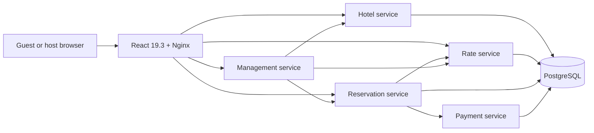

# Vela House — Hotel Reservation System

A hotel reservation platform inspired by ByteByteGo's [Hotel Reservation System](https://bytebytego.com/courses/system-design-interview/hotel-reservation-system). Guests can search Brazilian coastal stays and dates, compare live room availability and rates, make idempotent reservations, view or cancel trips, and hosts can manage hotels, rooms, rates, and reservations. Payments use a local simulator and demo tokens; the application does not collect real card numbers.

The web experience is a React 19.3 single-page app, the APIs are five Rust microservices, and PostgreSQL stores each service's data in a separate database. The design handoff lives in `design/opendesign/` and the React implementation uses optimized WebP photo assets.

## Architecture



| Component | Responsibility |
| --- | --- |
| `hotel-service` | Hotel and room catalog, property data, health endpoint |
| `rate-service` | Date-based nightly rates and rate management |
| `reservation-service` | Availability, idempotent booking, trip lookup and cancellation |
| `payment-service` | Simulated payment and refund records |
| `management-service` | Host overview and staff operations across services |
| `hotel-common` | Shared validation, date, authentication and error helpers |
| `web/` | Responsive guest and host experience, API client, metadata and assets |

Each Rust service owns its schema and database (`hotel_service`, `rate_service`, `reservation_service`, and `payment_service`). Reservation requests coordinate availability, rates, and the payment simulator. Nginx serves the SPA and proxies same-origin `/api` requests to the services.

## Run locally

Requirements: Rust toolchain from `rust-toolchain.toml`, Docker, Node.js 20.19+, npm, Kind, and kubectl.

### Kubernetes on Kind

The `hotel-system` Kind cluster should exist before deploying. The setup script builds and loads local images, applies the `hotel-rust` namespace and manifests, then waits for rollouts.

```sh
kind create cluster --name hotel-system
./scripts/kind-up.sh
```

There are two replicas for each of the five Rust microservices and the web deployment. PostgreSQL runs as a single-replica StatefulSet with a persistent volume. In another terminal:

```sh
./scripts/kind-port-forward.sh
```

Open <http://127.0.0.1:4173/>. The local staff token is `local-kind-staff-token-change-me`; change the demo secret before exposing this stack beyond localhost.

### Docker Compose

```sh
docker compose up --build
```

Open <http://127.0.0.1:8088/>. Compose exposes PostgreSQL on `127.0.0.1:55433` for local tests.

## Tests and coverage

Rust tests exercise request validation, booking and cancellation behavior, idempotency, and simulated payment flows using PostgreSQL-backed test databases. The React tests use Vitest and Testing Library.

| SonarCloud project | Coverage | Open issues |
| --- | ---: | ---: |
| [hotel-service](https://sonarcloud.io/project/overview?id=marcelomiyake_hotel-rust_hotel-service) | 99.5% | 0 |
| [rate-service](https://sonarcloud.io/project/overview?id=marcelomiyake_hotel-rust_rate-service) | 100.0% | 0 |
| [reservation-service](https://sonarcloud.io/project/overview?id=marcelomiyake_hotel-rust_reservation-service) | 96.5% | 0 |
| [payment-service](https://sonarcloud.io/project/overview?id=marcelomiyake_hotel-rust_payment-service) | 99.5% | 0 |
| [management-service](https://sonarcloud.io/project/overview?id=marcelomiyake_hotel-rust_management-service) | 99.2% | 0 |
| [hotel-common](https://sonarcloud.io/project/overview?id=marcelomiyake_hotel-rust_hotel-common) | 91.0% | 0 |
| [web](https://sonarcloud.io/project/overview?id=marcelomiyake_hotel-rust_web) | 91.7% | 0 |

All seven [SonarCloud monorepo projects](https://sonarcloud.io/organizations/marcelomiyake/projects?sort=-analysis_date) report zero open issues. The 2026-10-01 analysis also reported zero bugs, vulnerabilities, and code smells, with all seven quality gates passing. Overall coverage exceeds 90% in every project. [SonarQube Cloud automatic analysis does not support Rust](https://docs.sonarsource.com/sonarqube-cloud/analyzing-source-code/automatic-analysis#supported-languages), so Rust LCOV reports are generated with `cargo llvm-cov` and imported with `cargo sonar-scanner`. To run the full sequence locally, start the Compose PostgreSQL test database and set `SONAR_TOKEN`, then run:

```sh
docker compose up -d --wait postgres
./scripts/sonar-analyze.sh
```

The GitHub Actions workflow is in `.github/workflows/sonarcloud.yml`; add a repository Actions secret named `SONAR_TOKEN` to enable its scans. No token is stored in this repository.

## Lighthouse and search metadata

Lighthouse 13.5.0 was run against the Compose deployment on 2026-10-01. Scores below are the observed local results. Lighthouse's Agentic Browsing category is experimental; its scoring is described in [Chrome's Lighthouse documentation](https://developer.chrome.com/docs/lighthouse/agentic-browsing/scoring).

| Form factor | Performance | Accessibility | Best Practices | SEO | Agentic Browsing |
| --- | ---: | ---: | ---: | ---: | ---: |
| Desktop | 100 | 100 | 100 | 100 | 100 |
| Mobile | 100 | 100 | 100 | 100 | 100 |

The frontend has page titles, description and social metadata, structured organization data, `robots.txt`, and `llms.txt`. Image sizes and responsive WebP sources are set to keep the initial page light.


## Implementation analysis

### Scope and checks

- Five Rust services, one shared Rust crate, a React 19.3 application, PostgreSQL migrations, Docker Compose, and Kind manifests.
- Kind verification: all six deployments were ready at 2/2 replicas; PostgreSQL was ready at 1/1.
- Rust test suite: 34 tests passed across the six packages.
- Frontend: `npm run check`, `npm run test:coverage` (19 tests), and `npm run build` passed. Vitest reported 96.44% line coverage; SonarCloud's configured frontend source scope reports 91.8%.
- Lighthouse: all five categories scored 100 on both desktop and mobile.
- Source/configuration size: **6,839 nonblank LOC across 56 files**, counted on 2026-09-28. The count includes `.rs`, `.ts`, `.tsx`, `.css`, `.html`, `.sql`, `.sh`, `.toml`, `.yaml`, `.yml`, `.json`, `.conf`, and `.svg` files; excludes lockfiles, generated/build/dependency directories, and the OpenDesign prototype/assets.

### Harness and token usage

Harness for this task: **Codex, GPT-6 Luna, max effort**. The Codex session log and cache were empty before work began. The final session counters from the Codex JSONL log are:

| Counter | Tokens | Notes |
| --- | ---: | --- |
| Input | 64,359,785 | Includes cached input below |
| Cached input | 62,662,400 | Subset of input |
| Uncached input | 1,697,385 | Input less cached input |
| Output | 356,024 | Includes reasoning below |
| Reasoning | 205,900 | Subset of output, not added again |
| Total input + output | 64,715,809 | |

Worked for 2h 32m 55s

Using the [official GPT-6 Luna model pricing](https://developers.openai.com/api/docs/models/gpt-6-luna) and [OpenAI API pricing](https://developers.openai.com/api/docs/pricing?tab=suite) consulted on 2026-09-28 (uncached input $0.10/M tokens, cached input $0.01/M, output $0.50/M), the API-equivalent estimate is **$0.97437450 USD** (about **$0.97**). Reasoning tokens use the output rate and are already included in output. This is a token-based API equivalent, not the Codex subscription charge.

OpenDesign's local telemetry separately recorded 8,089,760 effective-input counters across its GPT-6 Luna handoff/dev-loop runs. Its database does not provide a complete cached-input/output/reasoning breakdown, so those counters are disclosed separately and are not included in the priced Codex estimate.

### Original request

<details>
<summary>Expand the full task prompt</summary>

```text
Implement https://bytebytego.com/courses/system-design-interview/hotel-reservation-system in Rust, React 19.3 (handoff from OpenDesign [To start it, from ~/.local/share/open-design, run ./node_modules/.bin/tools-dev start. Web UI: http://127.0.0.1:41919, self-hosted]), PostgreSQL, and Kubernetes via local Kind (2 replicas for each microservice). Use SonarQube Cloud via Chrome (https://sonarcloud.io/organizations/marcelomiyake/) to create and manage these monorepo projects, and complete this job with zero SonarQube issues and test coverage above 80%. If you need to run the scanner from the command line, I updated ~/.zshrc with the SONAR_TOKEN. Still, you can also use GitHub Actions and push commits in a loop until the issues are clean (the problem is that Rust is not supported for automatic analysis (https://docs.sonarsource.com/sonarqube-cloud/analyzing-source-code/automatic-analysis#supported-languages), so use another approach to consider Rust code in SonarQube Cloud (https://docs.sonarsource.com/sonarqube-server/analyzing-source-code/languages/rust); if you generate another SONAR_KEY, update it in the GitHub project or in .zshrc. The frontend should have a perfect Lighthouse grade and good SEO META in 1 Click. Finally, update the README.md with a screenshot and an analysis that includes this prompt, the harness used here (Codex, GPT-6 Luna with max effort), and the token costs from the sessions to complete this task (input tokens, cache tokens, reasoning tokens, output tokens) and LOC. The cache and sessions were empty just before starting this session. Consult the OpenAI official documentation for token prices to estimate total costs.
```

</details>

## Reservation abandonment analytics (2026-10-01)

The booking flow now records an anonymous journey when the reservation form opens. PostgreSQL stores a compact current-state row in `reservation_journeys` and an append-only event history in `reservation_journey_events`. The journey ID is a random UUID; the analytics events contain hotel and room IDs and the last checkout screen, with no guest name, email address, or payment token.

Screen focus and form activity update the last screen to `guest_details` or `payment`. Same-screen activity heartbeats are rate-limited to once per minute, while section transitions are recorded immediately. When the reservation service confirms a successful payment, it marks the journey completed in the same transaction. A journey is considered abandoned after 30 minutes without activity and remains queryable through the `abandoned_reservation_journeys` view. No administrative frontend was added.

The application sends `POST /api/reservation-journeys` to start a journey and `POST /api/reservation-journeys/{journey_id}/screens` on section transitions and periodic activity heartbeats. The reservation service routes these to `/v1/reservation-journeys` and `/v1/reservation-journeys/{journey_id}/screens`.

Example database query for bookings left in the payment section:

```sql
SELECT journey_id, hotel_id, room_type_id, last_screen, started_at, last_activity_at
FROM abandoned_reservation_journeys
WHERE last_screen = 'payment'
ORDER BY last_activity_at DESC;
```

### Change and quality statistics

The analytics implementation commit, [`c747869`](https://github.com/marcelomiyake/hotel-rust/commit/c747869746c8b321ce23d9180d80599c7447242b), changed seven files: one SQL migration was created, six existing code, configuration, and test files were changed, and no files were deleted. Its Git diff contains **476 inserted lines and 27 removed lines** (net +449). The new migration creates two tables, two indexes, and the abandonment view.

The web performance pass adds prerendered HTML for the home page, embeds its stylesheet in the page, and loads the trips and host tools on demand. It creates four source files and changes three existing files, with no file deletions.

Across the analytics implementation, web performance pass, and this README report, the diff changes **14 files**: five created, nine modified, and none deleted, with **740 inserted lines and 177 removed lines** (net +563).

The current source/configuration inventory is **7,306 nonblank LOC across 61 files**, excluding this README, lockfiles, generated/build/dependency directories, and the OpenDesign prototype/assets. The count covers `.rs`, `.ts`, `.tsx`, `.mjs`, `.css`, `.html`, `.sql`, `.sh`, `.toml`, `.yaml`, `.yml`, `.json`, `.conf`, and `.svg` files.

| Check | Result |
| --- | ---: |
| Rust workspace tests | 34 passed |
| Frontend tests | 19 passed |
| Frontend Vitest line coverage | 96.42% |
| Frontend SonarCloud coverage | 91.8% |
| Reservation service SonarCloud coverage | 96.5% |
| SonarCloud open issues across all seven projects | 0 |
| SonarCloud bugs, vulnerabilities, and code smells across all seven projects | 0 |
| SonarCloud quality gates | 7 passed |

All six Rust packages passed the repository's `cargo llvm-cov --fail-under-lines 80` checks. The TypeScript check, frontend coverage run, and production build passed. The live Compose smoke check confirmed that Nginx forwards journey events and that a `payment` screen checkpoint is stored in PostgreSQL.

Lighthouse 13.5.0 on the Compose deployment scored **100 in all five categories** on desktop and mobile, including Performance, Accessibility, Best Practices, SEO, and Agentic Browsing. The page's SEO META checks scored 100 on both form factors. Repeated mobile runs scored 100 Performance; Lighthouse reported no browser-console errors. The homepage is prerendered into HTML, its CSS is inline to remove the render-blocking stylesheet request, and the trips and host screens load as separate on-demand chunks.

### Harness and token cost for this feature session

Harness: **Codex, GPT-6 Luna (`gpt-6-luna`), max effort**. The session and cache were empty before the task began, as specified in the prompt. These are cumulative Codex session-log counters captured at 2026-10-01 18:20 UTC before final README editing and the final Git operations; cached input is included in input, and reasoning is included in output.

| Counter | Tokens | Notes |
| --- | ---: | --- |
| Input | 20,495,593 | Includes cached input below |
| Cached input | 20,061,184 | Subset of input |
| Uncached input | 434,409 | Input less cached input |
| Output | 142,242 | Includes reasoning below |
| Reasoning | 100,798 | Subset of output; not counted twice |
| Total input + output | 20,637,835 | |
| Cache writes | 0 | |

The [official GPT-6 Luna model page](https://developers.openai.com/api/docs/models/gpt-6-luna) and [OpenAI API pricing](https://developers.openai.com/api/docs/pricing?tab=suite), checked on 2026-10-01, list standard rates of $0.10/M uncached input, $0.01/M cached input, and $0.50/M output tokens. Using those rates, the API-equivalent estimate is **$0.31517374 USD** (about **$0.32**): $0.04344090 uncached input + $0.20061184 cached input + $0.07112100 output. Reasoning tokens use the output rate and are already included in output. This is a token-based API equivalent, not the Codex subscription charge.

<details>
<summary>Full prompt analyzed for this feature</summary>

```text
I want you to implement a new feature that identifies when a user starts a reservation but abandons it before paying. I want us to track which screen the user stopped at before abandoning the reservation. No administrative frontend implementation is needed; I want the data stored in the database (it doesn't need to be the same existing relational database) so we can use it later to improve the system. So it's not necessary to change the frontend features for the user, but you can change the structure to track user events. In this case, if you change it, the frontend should have a perfect Lighthouse grade and good SEO META in 1 Click. Complete this job with zero SonarQube issues (not only new, but zero in total) and test coverage above 80%. I also want to add a new section to README.md with statistics for this new feature. Include the number of changes (how much was deleted, created, changed, etc.), an analysis that includes this prompt, the harness used here (Codex, GPT-6 Luna with max effort), and the token costs from the sessions to complete this task (input tokens, cache tokens, reasoning tokens, output tokens), plus LOC. The cache and sessions were empty just before starting this session. Consult the OpenAI official documentation for token prices to estimate total costs. Commit following https://www.conventionalcommits.org/and push to GitHub after all.
```

</details>
